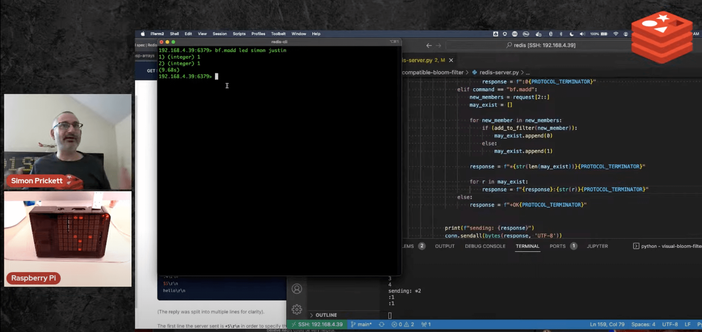

# Redis Compatible Bloom Filter

Attempt to build a Bloom Filter implementation using a [Pimoroni Unicorn HAT](https://shop.pimoroni.com/products/unicorn-hat?variant=932565325) on a Raspberry Pi that talks the RESP protocol.  This is the repo to support my livestream series "Things on Thursdays" ([see all episodes](https://simonprickett.dev/things-on-thursdays-livestreams/)).  This needs to be run on a Raspberry Pi with a Unicorn HAT attached.



Here's the videos from this series:

* [Episode One - RESP protocol and exploring Redis Sets](https://www.youtube.com/watch?v=uyjAFP73ttI)
* [Episode Two - Working with the LEDs and Bloom Filter Commands](https://www.youtube.com/watch?v=Ym4g5iti3bo)

The current state of this is that it has basic support for `BF.ADD`, `BF.EXISTS` and `BF.MADD` commands with little error checking.

It uses [`nodemon`](https://www.npmjs.com/package/nodemon) to restart the process when you save changes, so you'll need both Python 3 and Node.js if you want to take advantage of that.  We'll cover software setup later.

## Shopping List

If you want to build one of these, you'll need to have/buy the following items (links to specific suppliers, others are available - Google the items to find suppliers in your country to avoid foreign exchange and import costs):

* A [Raspberry Pi](https://www.raspberrypi.com/products/) (Model 3A, 3B or any model 4) - get whichever you have or can find, as there's a shortage right now.  The 3B is a solid all rounder to use on other future projects too.
* A decent power supply as this will have to power the Pi and the LEDs.  You'll want a [USB C](https://www.raspberrypi.com/products/type-c-power-supply/) one if using a Raspberry Pi 4, or a [micro USB version](https://www.raspberrypi.com/products/micro-usb-power-supply/) for all other Pi models.  Make sure to get one with the right wall plug for your country!
* A [Micro SD card](https://www.mymemory.co.uk/memory/memory-cards/micro-sd.html) (8gb should do, larger won't hurt).  You may need a micro SD to regular SD card adapter to connect the card to your laptop/desktop machine to write the Pi OS image to it.  Many micro SD cards come with this adapter.
* A [Pimoroni Unicorn HAT](https://shop.pimoroni.com/products/unicorn-hat?variant=932565325) (the 8 x 8 version)
* Optional: A case for the Raspberry Pi with a lid that diffuses the LEDs a bit.  I use this one in smoke grey from Adafruit: ([case for Pi 3](https://www.adafruit.com/product/2256), [lid for Pi 3](https://www.adafruit.com/product/2244)).  They make these for the Pi Model A too, but it appears that it's not available for the Pi 4.

## Rasperry Pi Setup

Raspberry Pi have great documentation ([here](https://www.raspberrypi.com/documentation/computers/getting-started.html)) showing how to set up the operating system on a new Pi using their tool that will flash an operating system image to your micro SD card.  You'll want to pay attention to their instructions for how to configure your WIFI and give the Pi a hostname e.g. `bloom.local`.  It's also useful to turn on SSH (Secure Shell).

We'll assume from here on that your Pi is configured and connected to the network, has SSH enabled, and that you know its hostname or IP address and a username/password to connect to it.

## Unicorn Hat Setup

With the Raspberry Pi turned off, orient the Unicorn HAT so that the LEDs cover the majority of the Raspberry Pi board, then press the Unicorn HAT onto the GPIO pins.  Ensure a firm connection.

## Software Setup / Install Dependencies

### Optional (for developing new functionality only)

If you want to use nodemon to automatically restart the Bloom Filter server every time you change the Python code, you'll need to install an up to date version of Node.js on the Pi.  If you just want to run the Bloom Filter code and use it, or don't feel you'll benefit from automatic restarts on change in your development process feel free to skip this step and go straight on to the "Required" section.

Get a modern version of Node by [following the guide here](https://randomnerdtutorials.com/how-to-install-the-latest-version-of-node-js-in-raspberry-pi/).

### Required

Connect to your Raspberry Pi using SSH (`ssh <username>@<hostname or ip address>` e.g. `ssh pi@bloom.local`), then enter these commands - skip `npm install` if you opted not to use nodemon:

```bash
git clone https://github.com/simonprickett/redis-compatible-bloom-filter.git
cd redis-compatible-bloom-filter
python3 -m venv venv
. ./venv/bin/activate
```

If you installed Node in the previous optional step, you'll also want to enter the following command to install nodemon:

```
npm install
```

## Run the Server

If you installed `nodemon`, start the server on port 6379:

```bash
sudo bash
./run.sh
```

Or without `nodemon`:

```bash
sudo bash
python redis-server.py
```

Note that you need to use the `sudo` command to run the code as the `root` user because of the way that the Unicorn Hat LED SDK works.

## Using the Bloom Filter with redis-cli:

Example interactions using the real `redis-cli`, assuming the Raspberry Pi's IP address is `192.168.4.39` (yours will vary or you can alternatively use the hostname if you configured one e.g. `bloom.local`):

```
redis-cli -h 192.168.4.39 -p 6379
192.168.4.39:6379> bf.madd leds a b c
1) (integer) 1
2) (integer) 1
3) (integer) 1
(14.64s)
192.168.4.39:6379> bf.madd leds a b d e
1) (integer) 0
2) (integer) 0
3) (integer) 1
4) (integer) 1
(29.20s)
192.168.4.39:6379> bf.exists leds r
(integer) 0
(2.45s)
192.168.4.39:6379> bf.exists leds d
(integer) 1
(7.31s)
```

Note that the key name isn't used in the code as there's only one Unicorn HAT attached to the Pi, which is used to represent a single Bloom Filter.  Key names are required but you can use any key name you like.

## Using the Bloom Filter with a Redis Client:

Given some limitations (see later) you can write code using your choice of Redis client that uses the LED Bloom Filter.  It will run slowly as the filter is slow, but as far as the programmer's concerned it looks like normal code that uses Redis.  Here's an example with the popular [node-redis](https://github.com/redis/node-redis) client for Node.js:

```javascript
import { createClient } from 'redis';

const KEY_NAME = 'led';

const client = createClient({
  url: 'redis://192.168.4.39:6379/' // or redis://bloom.local:6379/ etc
});

await client.connect();

await client.bf.add(KEY_NAME, 'steve');
await client.bf.add(KEY_NAME, 'josefin');
await client.bf.mAdd(KEY_NAME, [
  'justin',
  'nava',
  'kyle'
]);

console.log(await client.bf.exists(KEY_NAME, 'kyle'));
console.log(await client.bf.exists(KEY_NAME, 'elena'));

await client.disconnect();
```

## Limitations

This is a fun demo that's not intended for production use :)  It runs slowly so that you can watch the state changes on the LEDs.  It also doens't support [pipelining](https://redis.io/docs/manual/pipelining/) in the Redis protocol, so won't be able to talk to a client that optimizes network traffic to Redis with that.

Remember also that this demo doesn't pay attention to the Redis key name that you pass it in the commands... any command with the correct syntax will be executed against the same Bloom Filter instance, as there's only one Unicorn HAT connected to the Pi storing and displaying the state of the filter.

If you want to run a fast and scalable Bloom Filter in Redis, check out [Redis Stack](https://redis.io/docs/stack/get-started/).
